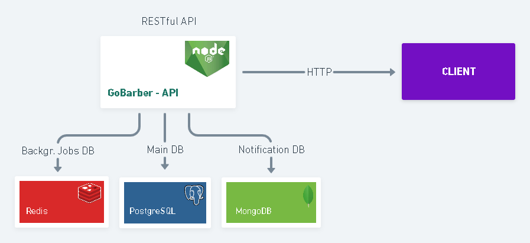

<div align="center">
    
  <h1>GoBarber</h1>
</div>
<p align="center">🚀 Appointment Management API for Barber Services</p>
<p align="center">
  
  
  
  
</p>

<div align="center">
 <a href="#-objective">objective</a> •
 <a href="#-roadmap">roadmap</a> • 
 <a href="#-technologies">technologies</a> • 
 <a href="#-licence">license</a> • 
 <a href="#-author">author</a>
</div>

---
</br>
<p align="center" >
  
</p>

## 💡 Objective
<p>The main purpose of this API is to connect service providers (barbers) to their customers, so they can more easily manage their appointments.</p>
<p>Basically, the API allows both types of users to register in the system. Barbers will be responsible for managing appointments and clients will be responsible for choosing and hiring a preferred barber. </p>

**> [Check the web version](https://github.com/mathmelo/GoBarber-React)**

## 🎌 Roadmap

### Prerequisites
Before starting, you will need to have the following tools installed on your machine:
<ul>
  <li><a href="https://git-scm.com">Git</a></li>
  <li><a href="https://nodejs.org/en/">Node</a></li>
  <li><a href="https://docs.docker.com/engine/install/">Docker</a></li>
  <li><a href="https://yarnpkg.com/getting-started/install">Yarn</a></li>
</ul>

You can also use npm, but we seriously recommend yarn.

Also it's nice to have an editor to work with the code like [VSCode](https://code.visualstudio.com/).

### Running the Back End (server)

To execute these commands, you will need to create 3 containers in the docker
- [Postgres database](https://hub.docker.com/_/postgres)
- [MongoDB database](https://hub.docker.com/_/mongo)
- [Redis database](https://hub.docker.com/_/redis)

**🚫 Important**
- A .env file must be created in the project's root folder containing all access keys, including  to the databases.
- The .env.exemple file can be used as an example

**Execute the commands**

```bash
# Clone this repository
$ git clone https://github.com/mathmelo/GoBarber-NodeJS-Backend

# Access the project folder in the terminal/cmd
$cd GoBarber-NodeJS-Backend

# Install dependencies
$ yarn

# Run migrations
$ yarn migrate

# Run the application in development mode
# The application must run on two nodes. If you are using VsCode, just open a terminal for each of these commands
$ yarn queue
$ yarn dev

# The server will start on port:3335 - go to <http://localhost:3335>
```

## 💜 Technologies
- Javascript
- NodeJS
- Express
- Postgres, MongoDB and Redis
- Sequelize
- Sentry
- Nodemailer
- JWT

## 📕 License

Read the license [here](https://github.com/mathmelo/GoBarber-NodeJS-Backend/blob/main/LICENSE).

## 🤓 Author

Informations about [me](https://github.com/mathmelo).
Send me a message! ;)

<h4 align="center"> 
	🚧  GoBarber 🚀 In construction...  🚧</br>
  <strong>Building docs</strong>
</h4>
